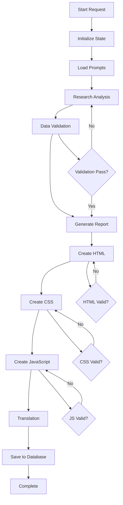

# AI Report Generator - Tài liệu Workflow

## 🔄 AI Report Generation Workflow

### Tổng quan
Hệ thống sử dụng **LangGraph** để orchestrate một workflow phức tạp tạo ra báo cáo cryptocurrency tự động với AI. Workflow được thiết kế theo mô hình state machine với error handling và retry mechanisms.

## 📊 Workflow Architecture



## 🎯 Workflow Steps

### 1. Initialize State
**File:** `app/services/report_workflow_v2.py`
**Function:** `generate_auto_research_report_langgraph_v2()`

```python
initial_state = ReportState({
    "session_id": session_id,
    "api_key": api_key,
    "max_attempts": max_attempts,
    "current_attempt": 1,
    "error_messages": [],
    "success": False,
    "model": "gemini-1.5-pro"
})
```

**Mục đích:**
- Khởi tạo session tracking
- Setup Gemini AI client
- Cấu hình retry parameters

### 2. Load Prompts
**File:** `app/services/workflow_nodes/base.py`
**Function:** `read_prompt_file()`

```python
prompts = {
    "research": "prompt_research_analysis.md",
    "validation": "prompt_data_validation.md", 
    "report": "prompt_create_report.md",
    "html": "prompt_create_html.md",
    "css": "prompt_create_css.md",
    "js": "prompt_create_javascript.md"
}
```

**Mục đích:**
- Load các template prompts từ `create_report/`
- Inject CSS variables từ `colors.css`
- Replace date placeholders

### 3. Research Analysis
**File:** `app/services/workflow_nodes/research_deep.py`
**Function:** `research_deep_node()`

**Process:**
1. Fetch real-time cryptocurrency data:
   - Global market data (CoinGecko)
   - BTC price và trends
   - Fear & Greed Index
2. Concurrent API calls với timeout protection
3. Generate comprehensive analysis với Gemini AI
4. Update progress tracking

**Input:** Market data, historical trends
**Output:** Detailed research analysis text

### 4. Data Validation
**File:** `app/services/workflow_nodes/validate_report.py`
**Function:** `validate_report_node()`

**Process:**
1. Validate research data accuracy
2. Check for inconsistencies
3. Verify market data freshness
4. AI-powered fact checking

**Decision Logic:**
```python
validation_result = check_report_validation(response)
if validation_result == 'PASS':
    # Continue to report generation
elif validation_result == 'FAIL' and attempts < max_attempts:
    # Retry research phase
else:
    # Proceed with warnings
```

### 5. Generate Report
**File:** `app/services/workflow_nodes/generate_report.py`
**Function:** `generate_report_node()`

**Process:**
1. Combine research analysis với template
2. Generate structured report content
3. Include real-time data integration
4. Format for web presentation

### 6. Create HTML Structure
**File:** `app/services/workflow_nodes/create_html.py`
**Function:** `create_html_node()`

**Process:**
1. Generate semantic HTML structure
2. Responsive design principles
3. Accessibility compliance
4. SEO optimization

**Output Validation:**
```python
result = extract_code_blocks(ai_response)
if result['success'] and result['html']:
    # HTML generation successful
```

### 7. Create CSS Styling
**File:** `app/services/workflow_nodes/create_css.py`
**Function:** `create_css_node()`

**Process:**
1. Generate responsive CSS
2. Inject color variables từ `colors.css`
3. Dark/light theme support
4. Mobile-first approach

**Features:**
- CSS Grid layouts
- Flexbox components
- Animation effects
- Print media queries

### 8. Create JavaScript
**File:** `app/services/workflow_nodes/create_javascript.py`
**Function:** `create_js_node()`

**Process:**
1. Interactive dashboard features
2. Real-time data updates
3. Chart integrations
4. Multi-language support

**Components:**
- Data visualization
- User interactions
- API integrations
- State management

### 9. Translation
**File:** `app/services/workflow_nodes/translate_content.py`
**Function:** `translate_content_node()`

**Process:**
1. Translate HTML content Vietnamese → English
2. Preserve HTML structure
3. Maintain formatting
4. Cultural context adaptation

### 10. Database Save
**File:** `app/services/workflow_nodes/save_database.py`
**Function:** `save_database_node()`

**Process:**
1. Create CryptoReport record
2. Store HTML, CSS, JS content
3. Save translated versions
4. Retry logic cho SSL errors

```python
new_report = Report(
    html_content=state["html_content"],
    css_content=state["css_content"], 
    js_content=state["js_content"],
    html_content_en=state["html_content_en"]
)
```

## 🔧 State Management

### ReportState Schema
```python
class ReportState(TypedDict):
    # Session tracking
    session_id: str
    
    # Input parameters  
    api_key: str
    max_attempts: int
    
    # Processing state
    research_content: Optional[str]
    report_content: Optional[str]
    validation_result: Optional[str]
    
    # Output content
    html_content: Optional[str]
    css_content: Optional[str] 
    js_content: Optional[str]
    html_content_en: Optional[str]
    
    # Control flow
    current_attempt: int
    error_messages: List[str]
    success: bool
    
    # Gemini client
    client: Optional[object]
    model: str
```

### State Transitions
1. **Initial** → **Loading Prompts**
2. **Loading Prompts** → **Research Phase**
3. **Research Phase** → **Validation Phase**
4. **Validation Phase** → **Report Generation** (nếu PASS)
5. **Validation Phase** → **Research Phase** (nếu FAIL + retry)
6. **Report Generation** → **HTML Creation**
7. **HTML Creation** → **CSS Creation**
8. **CSS Creation** → **JS Creation**
9. **JS Creation** → **Translation**
10. **Translation** → **Database Save**
11. **Database Save** → **Complete**

## 🔄 Error Handling & Retry Logic

### Retry Strategies

#### 1. Component-Level Retries
```python
# HTML/CSS/JS generation có independent retry counters
max_component_attempts = 3
if component_attempt < max_component_attempts:
    # Retry specific component
else:
    # Use fallback content
```

#### 2. Network Error Retries
```python
# SSL errors và connection issues
if is_ssl_error and attempt < max_retries:
    wait_time = 2 ** attempt  # Exponential backoff
    time.sleep(wait_time)
    continue
```

#### 3. Validation Retries
```python
# Research validation failures
if validation_result == 'FAIL' and current_attempt < max_attempts:
    state["current_attempt"] += 1
    # Return to research phase
```

### Error Categories

#### 1. Recoverable Errors
- SSL/TLS connection issues
- Temporary API failures
- Rate limiting
- Network timeouts

#### 2. Non-Recoverable Errors
- Invalid API keys
- Malformed prompts
- Database connection failures
- Out of memory errors

#### 3. Partial Failures
- Single component generation failures
- Translation errors
- Optional feature failures

## 📊 Progress Tracking

### Progress Updates
**File:** `app/services/progress_tracker.py`

```python
# Step tracking
progress_tracker.update_step(
    session_id=session_id,
    details="Generating HTML structure..."
)

# Completion tracking
progress_tracker.complete_progress(
    session_id=session_id,
    success=True,
    report_id=report_id
)

# Error tracking
progress_tracker.error_progress(
    session_id=session_id, 
    error_message="Failed to generate CSS"
)
```

### Progress Phases
1. **Initialization** (0-5%)
2. **Data Collection** (5-20%)
3. **Research Analysis** (20-40%)
4. **Validation** (40-50%)
5. **Report Generation** (50-60%)
6. **HTML Creation** (60-70%)
7. **CSS Creation** (70-80%)
8. **JS Creation** (80-90%)
9. **Translation** (90-95%)
10. **Database Save** (95-100%)

## 🎯 Performance Optimization

### Concurrent Processing
```python
# Parallel API calls
with ThreadPoolExecutor(max_workers=3) as executor:
    future_global = executor.submit(get_global_data)
    future_btc = executor.submit(get_btc_data)
    future_fng = executor.submit(get_fng_data)
```

### Caching Strategies
- Real-time data caching (5-minute TTL)
- Prompt template caching
- CSS variables caching

### Resource Management
- Database connection pooling
- Session lifecycle management
- Memory cleanup after completion

## 🔍 Monitoring & Debugging

### Logging Points
```python
print(f"✅ Research completed - {len(research_content)} chars")
print(f"⚠️ Validation failed - attempt {current_attempt}")
print(f"❌ Component generation failed: {error}")
```

### Progress Monitoring
```bash
# Check progress endpoint
GET /reports/progress/{session_id}

# Response format
{
    "session_id": "uuid",
    "current_step": 5,
    "total_steps": 10,
    "details": "Generating HTML structure...",
    "completed": false,
    "error": null
}
```

### Debug Mode
```python
# Enable SQL query logging
engine = create_engine(DATABASE_URL, echo=True)

# Detailed progress logging
ENABLE_DETAILED_LOGGING = True
```

## 🚀 Integration Points

### API Endpoints
```python
# Start workflow
POST /reports/auto-generate
{
    "session_id": "optional-uuid"
}

# Check progress  
GET /reports/progress/{session_id}

# Get result
GET /reports/{report_id}
```

### External Services
- **CoinGecko API:** Market data
- **Alternative.me:** Fear & Greed Index
- **Google Gemini:** AI text generation
- **PostgreSQL:** Data persistence

### Background Processing
```python
# FastAPI Background Tasks
@router.post("/auto-generate")
async def generate_report(background_tasks: BackgroundTasks):
    background_tasks.add_task(run_workflow, session_id)
    return {"session_id": session_id}
```

---
**Version:** 2.0  
**Last Updated:** 18/08/2025  
**Architecture:** LangGraph + FastAPI + PostgreSQL
